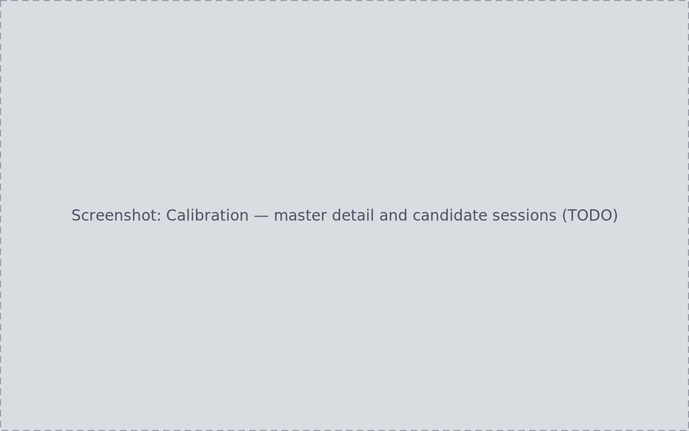

<!-- WRITER TODO: Document ingesting masters through the Inbox, the
Calibration page/master detail, ranked candidate sessions, explicit
assignment, tolerance tuning, and replacing a mis-assigned master.
Ground truth:
- docs/journeys/J08-calibration-ingest-masters-matching/journey.md (S1-S8)
- docs/journeys/J11-mistake-recovery/journey.md (S6, replace mis-assigned master)
- Cross-link candidates: manual/inbox.md -->

