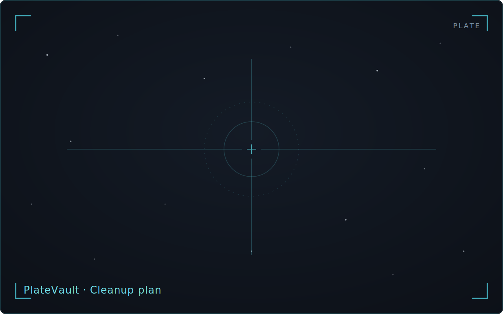

<!-- WRITER TODO: Document cleanup-candidate scanning for project outputs
and session raw sub-frames, destination choice (Archive folder vs. OS
trash), plan review/apply, re-scan confirmation, and protected-file
exclusion. Distinguish from whole-project archiving (covered in
projects-lifecycle.md).
Ground truth:
- docs/journeys/J06-cleanup-scan-review-apply/journey.md (S1-S6)
- docs/journeys/J07-archive-delete/journey.md (protection framing)
- Cross-link candidates: manual/setup-wizard.md (protection defaults),
  manual/projects-lifecycle.md -->

