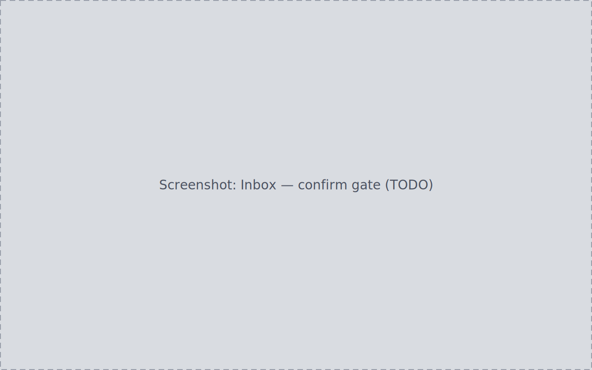

<!-- WRITER TODO: Document the Inbox as the single ingest/confirm gate: the
move-into-library path (rescan, per-file detail, bulk reclassify, choose
destination, confirm, review plan, apply, verify) and the catalogue-in-place
path for already-organized folders, plus mistake recovery before Apply.
Ground truth:
- docs/journeys/J02-ingest-review-reclassify-confirm-move/journey.md (S1-S8)
- docs/journeys/J03-ingest-confirm-catalogue-in-place/journey.md (S1-S5, mixed-root routing)
- docs/journeys/J11-mistake-recovery/journey.md (S1-S5, pre-apply corrections)
- Cross-link candidates: how-to/ingest-first-session.md,
  how-to/organize-existing-library.md -->

