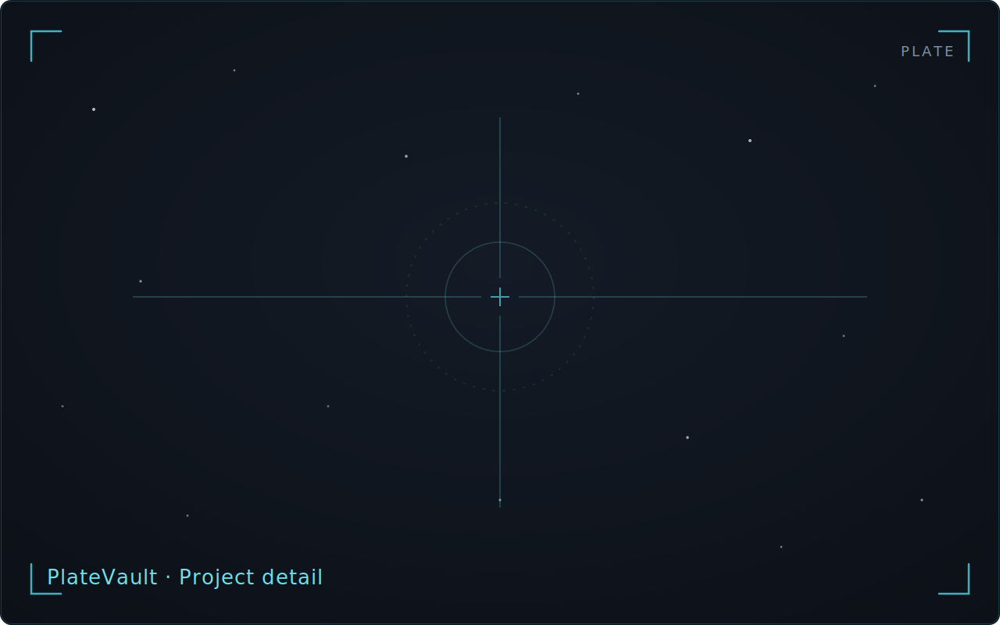

<!-- WRITER TODO: Document project creation/attach-sessions/per-channel
numbers/manifests/tool-launch/artifact-observation, then the archive
lifecycle (plan review/apply, Archive page, trash vs. typed-DELETE permanent
removal, reveal).
Ground truth:
- docs/journeys/J05-project-lifecycle/journey.md (S1-S6)
- docs/journeys/J07-archive-delete/journey.md (S1-S8)
- Cross-link candidates: manual/cleanup-archive.md,
  how-to/prepare-for-pixinsight.md -->

