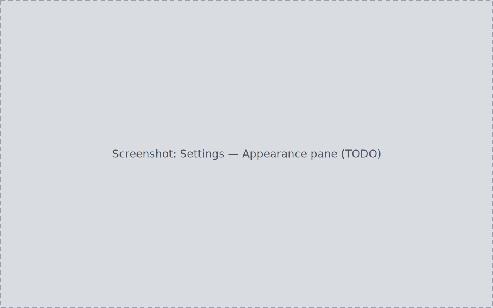

<!-- WRITER TODO: Document appearance/layout, data-source and ingestion
defaults, Equipment (cameras/telescopes/optical trains/filters), Target
Planner (sites, altitude threshold, moon-avoidance), Danger controls, the
Audit Log, and the no-raw-strings localization guarantee.
Ground truth:
- docs/journeys/J10-settings-appearance-i18n/journey.md (S1-S10)
- docs/journeys/J15-equipment-observing-site-setup/journey.md (S1-S9)
- Cross-link candidates: manual/targets-planning.md, manual/updater.md -->

