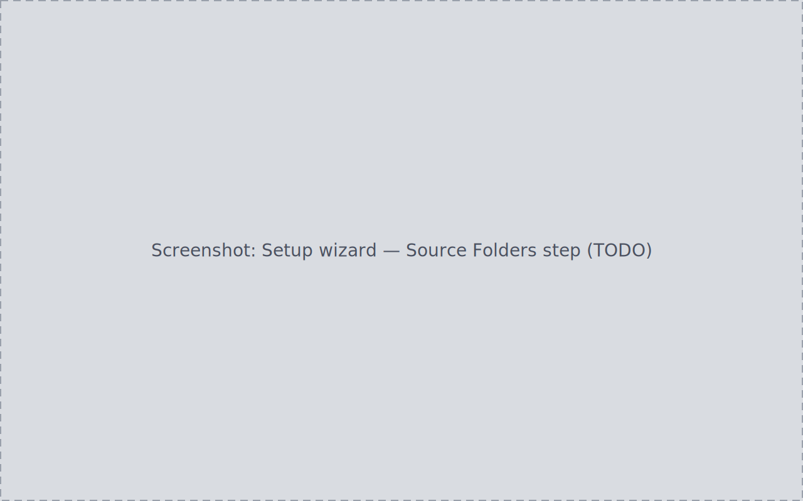

<!-- WRITER TODO: Document the 6-step first-run wizard (Source Folders,
Processing Tools, Configuration, Observing Site, Confirm, Scan) and the
ongoing per-source actions (Rescan, Remap, Disable/Enable, Delete, protection
override, reveal in file manager).
Ground truth:
- docs/journeys/J01-first-run-setup-data-sources/journey.md (S1-S14, full step detail)
- PRODUCT.md (local-first file custody framing)
- Cross-link candidates: manual/inbox.md (Finish lands on Inbox),
  how-to/recover-after-moving-a-drive.md (Remap workflow) -->

