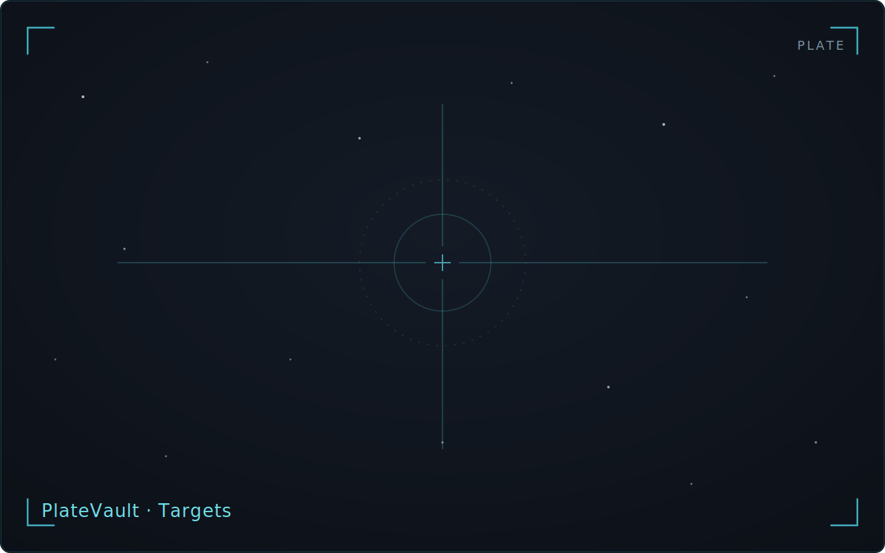

<!-- WRITER TODO: Document target search/add/identity-editing/favouriting,
per-site tonight's-astronomy (and the no-site placeholder), and starting a
project directly from a target's detail (target<->project link).
Ground truth:
- docs/journeys/J09-targets-planning/journey.md (S1-S5)
- docs/journeys/J14-target-first-project-start/journey.md (S1-S7)
- Cross-link candidates: manual/settings.md (Target Planner site config),
  manual/projects-lifecycle.md -->

