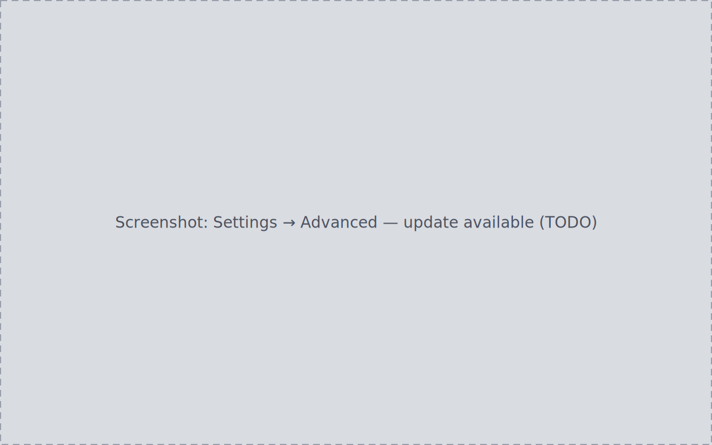

<!-- WRITER TODO: Document the background update check, signature-verified
install flow, and recovery from a failed check/install (every failure branch
leaves the running install untouched).
Ground truth:
- docs/journeys/J17-software-update-install/journey.md (S1-S4)
- Cross-link candidates: manual/settings.md (Settings → Advanced) -->

